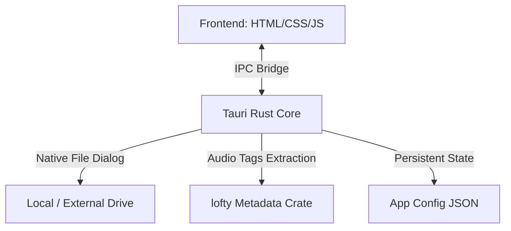

# Implementation Plan: Quaver Native macOS Music Player

A high-performance, lightweight, macOS-native FLAC/ALAC reader and player utilizing Tauri (Rust backend) and Vite (HTML/CSS/JS frontend).

## User Review Required
> [!IMPORTANT]
> - **External Drive Permissions:** On macOS, apps sandboxed via App Sandbox need security-scoped bookmarks to access folders on external volumes. We will configure Tauri's file-system permissions and save path states to the application's configuration directory.
> - **Metadata Parsing:** We will use Rust's `lofty` or `audiotags` crate for high-speed native audio metadata parsing (extracting titles, artists, and cover art), which is significantly faster than parsing over JavaScript bridge for large libraries.

---

## Proposed Changes & Architecture



### 1. Tauri Backend (Rust Configuration)
#### [NEW] [Cargo.toml](file:///Users/jay/Documents/Projects/quaver/src-tauri/Cargo.toml)
Configure Tauri dependencies, including:
- `lofty`: For fast FLAC/ALAC/M4A metadata extraction.
- `serde`: For serialization of playlist and tracks config state.

#### [NEW] [main.rs](file:///Users/jay/Documents/Projects/quaver/src-tauri/src/main.rs)
Implement Rust commands exposed to the frontend:
- `select_music_directory()`: Open native macOS folder chooser.
- `scan_directory(path)`: Recursively find `.flac`, `.m4a` (ALAC), `.mp3` and `.lrc` lyric files.
- `extract_metadata(file_paths)`: Read tags (title, artist, album, base64 cover art) natively.
- `save_config(path)` / `load_config()`: Persist last scanned directories.

### 2. Frontend Interface (Tauri UI)
#### [NEW] [index.html](file:///Users/jay/Documents/Projects/quaver/index.html)
Define app frame with macOS traffic light buttons, sidebar directories, main track lists, player controls, and fullscreen synced lyrics pane.

#### [NEW] [style.css](file:///Users/jay/Documents/Projects/quaver/src/style.css)
Design system for macOS native styles:
- Vibrant, semi-transparent panels.
- Rotating circular cover art (vinyl style with spindle hole cutout).
- Scrolling synced lyrics: large typography, active item magnified and glowed, past/future items blurred and faded.

#### [NEW] [app.js](file:///Users/jay/Documents/Projects/quaver/src/app.js)
App controller handling IPC invokes to Tauri commands, populating playlists, managing media playback states, parsing `.lrc` files, and handling auto-scroll.

---

## Verification Plan

### Automated Tests
- Build and run the app locally using:
  ```bash
  npm run tauri dev
  ```
- Verify Rust command execution output for directory scans.

### Manual Verification
1. Click **Add Folder** to select a music folder on your external drive.
2. Confirm the app successfully parses metadata and cover art.
3. Play a track, select the lyrics icon to enter fullscreen mode, and confirm the lyrics scroll and blur smoothly.
4. Relaunch the app to confirm it persists and re-scans the previous directory automatically.
